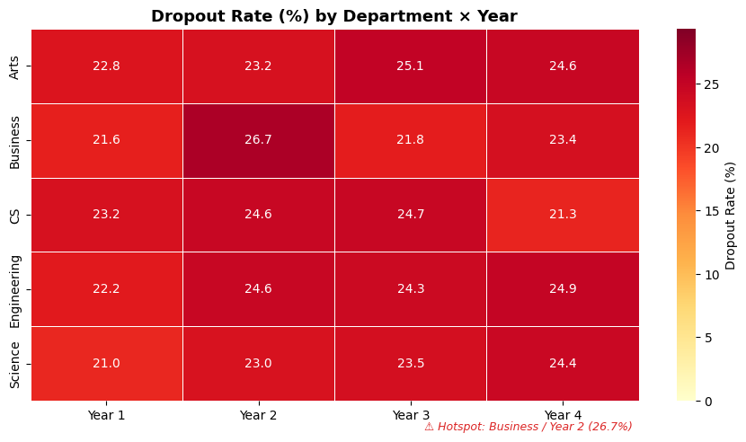
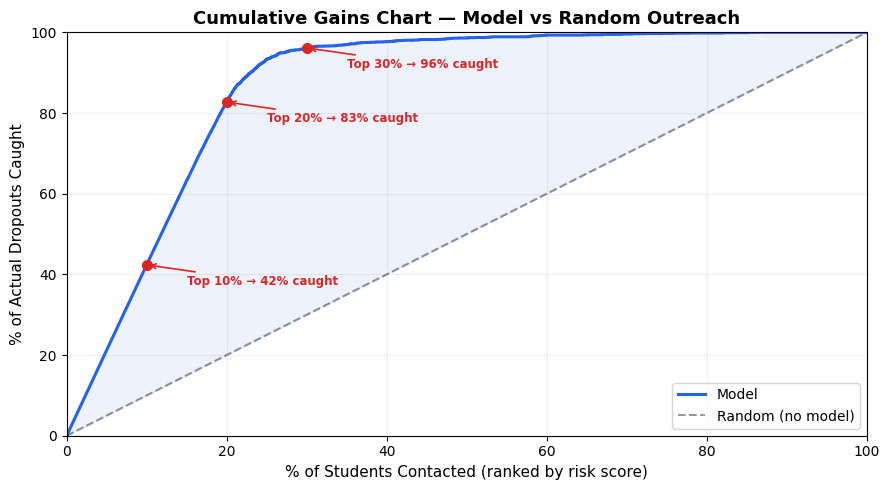

# Early Burnout Detection

## 1. Project Overview

This project implements an early-warning behavioural analytics pipeline for higher education institutions to identify students at risk before severe academic decline.  
The system uses behavioural and performance indicators to estimate dropout probability, derive a risk score, classify burnout risk level, highlight key behavioural triggers, and produce an intervention recommendation.

### Key Results

| Metric | Value |
|--------|-------|
| **Model** | RandomForest (400 trees) + SMOTE + Threshold Tuning |
| **ROC-AUC** | 0.803 |
| **Recall** | 74.1% — catches 3 out of 4 at-risk students |
| **F1 Score** | 0.573 |
| **Top-20% Lift** | Contacting the top 20% of flagged students catches **83%** of all actual dropouts |
| **Students Scored** | 10,000 with personalised triggers + interventions |

<p align="center">
  
</p>

The implementation is designed for hackathon delivery and production extension:

- Reproducible notebook workflow for model development in Google Colab.
- Reusable Python modules for data preparation, training, and risk decisioning.
- Artifact-based outputs that can be integrated into backend services and dashboards.

---

## 2. Problem Alignment

The solution is aligned with the stated challenge requirements:

- **Burnout Risk Level**: mapped from risk score into `Low`, `Medium`, `High` using adaptive bin boundaries.
- **Academic Disengagement Indicators**: represented through engineered interaction features and ranked trigger features.
- **Dropout Probability**: predicted using a supervised classification model with SMOTE oversampling.
- **Risk Score (0–100)**: computed from predicted dropout probability.
- **Key Behavioural Triggers**: extracted per-student using weighted feature deviation (demographics excluded).
- **Recommended Intervention Strategy**: generated by a rank-order rule-based engine matching triggers to actions.

---

## 3. Data Sources

The repository uses three datasets located in `data/`:

1. **`student_dropout_dataset_v3.csv`**  
	Core tabular dataset containing demographics, academic behaviour, stress index, and dropout label.  
	🔗 [Dataset Link](https://www.kaggle.com/datasets/meharshanali/student-dropout-prediction-dataset)

2. **`student_learning_interaction_dataset.csv`**  
	Session-level learning interaction logs used to build aggregated behavioural signals.  
	🔗 [Dataset Link](https://www.kaggle.com/datasets/ziya07/student-learning-interaction-logs-dataset?resource=download)

3. **`college_student_management_data.csv`**  
	Additional dataset included for further experimentation and alternate modeling paths.  
	🔗 [Dataset Link](https://www.kaggle.com/datasets/ziya07/college-student-management-dataset)

### Synthetic Feature Engineering

Because explicit textual feedback is not available in the dropout dataset, the pipeline generates:

- `synthetic_feedback` text from `Stress_Index`
- `sentiment_score` numeric signal from synthetic feedback

This enables inclusion of sentiment-informed behavioural context in the model input.

---

## 4. Repository Structure

```text
BehAnalytics/
├── data/
│   ├── college_student_management_data.csv
│   ├── student_dropout_dataset_v3.csv
│   └── student_learning_interaction_dataset.csv
├── notebooks/
│   ├── 01_data_preparation.ipynb
│   └── 02_model_training.ipynb
├── src/
│   ├── __init__.py
│   ├── data_pipeline.py
│   ├── modeling.py
│   └── risk_engine.py
├── scripts/
│   ├── prepare_data.py
│   └── train_model.py
├── configs/
│   └── model_config.yaml
├── artifacts/                    # generated at runtime
├── reports/                      # optional metrics/plots
├── requirements.txt
├── setup.sh
└── COLAB_SETUP.md
```

---

## 5. System Architecture

### 5.1 Data Layer

- Loads dropout and interaction datasets.
- Aggregates session logs per student (e.g., session count, average engagement metrics).
- Merges aggregated interaction features into primary student table.
- Handles missing values using median/mode fill strategies.

### 5.2 Modeling Layer

- Preprocessing with `ColumnTransformer`:
  - Numeric features: median imputation
  - Categorical features: most-frequent imputation + one-hot encoding
- **SMOTE** oversampling on training set only (no data leakage) to handle 3.25:1 class imbalance.
- **Dual-model comparison**: RandomForest (400 trees, balanced) vs XGBoost (400 rounds).
- Best model auto-selected by ROC-AUC on the held-out test set.
- **Threshold tuning**: precision-recall curve scan targeting recall ≥ 0.70 (optimal: 0.302 vs default 0.5).

### 5.3 Decision Layer

- Converts probability to risk score: `score = probability × 100`
- **Adaptive risk bins** (avoids hollow Medium bucket from bimodal tree distributions):
  - `Low` → score ≤ optimal threshold (~30)
  - `Medium` → threshold < score ≤ 85th percentile (~74)
  - `High` → score > 85th percentile
- Per-student **actionable triggers**: weighted deviation from cohort median × feature importance (demographics excluded).
- **Rank-order intervention matching**: walks triggers from most-important to least, first rule match wins.

---

## EDA: Where is Dropout Concentrated?

<p align="center">
  
</p>

Dropout rates range from 21% to 27% across departments and years, with **Business / Year 2** as the hotspot (26.7%). The relatively uniform distribution suggests dropout is a systemic issue — not isolated to one department — reinforcing the need for a universal early-warning system.

---

## 6. Environment Setup

### 6.1 Local Setup (macOS/Linux)

```bash
./setup.sh
source .venv/bin/activate
```

If running manually:

```bash
python3 -m venv .venv
source .venv/bin/activate
pip install --upgrade pip
pip install -r requirements.txt
python -m ipykernel install --user --name behanalytics --display-name "BehAnalytics (venv)"
```

### 6.2 Colab Setup

Refer to `COLAB_SETUP.md` for detailed Colab execution patterns.

---

## 7. End-to-End Execution

### Option A: Notebook Workflow (Recommended for Colab)

1. Open `notebooks/01_data_preparation.ipynb` and run all cells.  
	Output: `artifacts/engineered_features.csv`

2. Open `notebooks/02_model_training.ipynb` and run all cells.  
	Outputs:
	- `artifacts/dropout_model.joblib`
	- `artifacts/metrics.json`
	- in-notebook feature importance and sample prediction payload

### Option B: Script Workflow (Local CLI)

```bash
python scripts/prepare_data.py
python scripts/train_model.py
```

---

## 8. Core Outputs

For each evaluated student (or sample), the system provides:

- `dropout_probability` (0 to 1)
- `risk_score` (0 to 100)
- `burnout_risk_level` (`Low` / `Medium` / `High`)
- `key_behavioural_triggers` (top-5 actionable features per student)
- `recommended_intervention_strategy` (rule-based recommendation)

This output contract is suitable for integration with Node.js/FastAPI services and dashboard frontends.

---

## 9. Model Performance

### Confusion Matrix & ROC Curve

<p align="center">
  
</p>

At the optimised threshold of 0.302, the model catches **74.1%** of at-risk students (349 out of 471 in test set). The trade-off: 398 false positives — but in an early-warning system, a false alarm is far less costly than missing a student who drops out.

### Precision / Recall / F1 vs Threshold

<p align="center">
  
</p>

The optimal threshold (0.302) was auto-selected to maximise F1 while keeping recall ≥ 0.70. Moving it to the default 0.5 would increase precision but miss half the at-risk students.

### Cumulative Gains — Model vs Random Outreach

<p align="center">
  
</p>

**This is the key chart for stakeholders**: by contacting just the **top 20%** of flagged students, the model catches **83%** of all actual dropouts — a **4× improvement** over random outreach. At 30%, coverage reaches 96%.

### Feature Importance

<p align="center">
  
</p>

GPA, Semester GPA, and CGPA dominate model decisions, followed by Stress Index, sentiment score, and Attendance Rate. Demographic features (Age, Family Income, etc.) contribute but are excluded from student-facing trigger reports since they aren't actionable.

---

## 10. Personalised Risk Profiling

### Behavioural Trigger Radar — High vs Low Risk

<p align="center">
  
</p>

All axes point in the **risk direction** (larger = more at risk). Protective features (GPA, Attendance) are inverted. The high-risk student (red, score 84.2) shows a consistently larger polygon than the low-risk student (green, score 6.5) — each student gets a unique behavioural fingerprint.

### Intervention Strategy Distribution

<p align="center">
  
</p>

8 distinct intervention categories are assigned across 10,000 students. Attendance counselling (61.4%) is the most common — consistent with Attendance being the strongest early warning signal. Urgent flags (⚡) are reserved for High-risk students only.

---

## 11. Important Implementation Notes

- Current sentiment signal uses a deterministic lexical heuristic on synthetic feedback text.  
  This keeps the pipeline lightweight and reproducible in constrained hackathon environments.

- The architecture is intentionally modular so the sentiment step can be replaced with a transformer-based model (e.g., RoBERTa/IndicBERT) without changing downstream components.

- Feature importance from tree-based models is used for trigger explanation. SHAP beeswarm analysis is included in Notebook 02 for production-grade directional feature impact.

---

## 12. Model Governance and Limitations

- Dataset realism is limited by synthetic and simulated records.
- Intervention recommendations are rule-based and should be reviewed by domain experts before institutional deployment.
- Predictions should assist decision-making, not automate high-stakes actions without human oversight.

---

## 13. Suggested Next Extensions

- Add calibrated probability outputs (`CalibratedClassifierCV`).
- Add temporal drift and trend-based disengagement detection windows.
- Wrap model in FastAPI inference endpoint for web integration.
- Build student-level explanation cards for advisors.
- Add CI checks, unit tests, and data validation tests.

---

## 14. Reproducibility Checklist

- Fixed random seed in training pipeline.
- Versioned dependency list in `requirements.txt`.
- Artifact persistence for model and metrics.
- Single-source reusable logic under `src/`.

---

## 15. Contact and Ownership

Repository owner: `Aashik1701`  
Project: `Early-burnout-detection`

If this repository is used in competition or academic review, include:

- dataset references,
- engineered feature rationale,
- model selection rationale,
- ethics and intervention safeguards.

---

## 16. Frontend Dashboard (Streamlit)

The project includes a lightweight frontend dashboard at `dashboard/app.py` that reads:

- `artifacts/predictions.csv`
- `artifacts/metrics.json`

### Run

```bash
python scripts/train_model.py
streamlit run dashboard/app.py
```

### Dashboard Features

- KPI cards (students, high-risk count, average risk score, recall by mode)
- Mode toggle (`balanced` vs `high_recall`)
- Balanced vs high-recall trade-off comparison chart
- Urgent-only intervention filter and outreach capacity planner
- Auto recommended threshold by outreach capacity
- What-if threshold simulator for flagged-load planning
- Threshold sweep chart (flagged load vs high-risk coverage)
- Risk-level distribution and risk-score histogram
- Top behavioural triggers chart
- Intervention strategy mix visualization
- Action queue table with intervention recommendations
- Filtered queue CSV download
- Student-level drilldown view
- **Intervention Planner** — counselor capacity, weekly contact slots, round-robin assignment, prioritized list by urgency, downloadable assignment sheet
- **Program Impact** — expected students contacted, high-risk capture estimate, false-positive load at selected threshold, workload by strategy type, impact efficiency summary
- **Cohort Insights** — stacked bars for risk level distribution, average risk score, and high-risk rate by department/semester/gender/job status, cross-dimension heatmap
